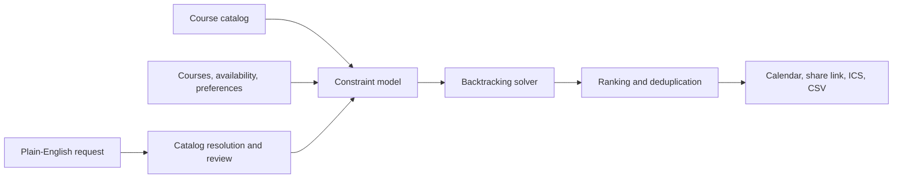

# Hey, I'm Donovan.

Computer science at NJIT, graduating May 2027. Previously a software engineering intern at **Universal Music Group** and **Obsidian Security**.

I build full-stack software that people actually use. Most of my work starts with an annoying real-world problem and ends somewhere between data pipelines, backend systems, algorithms, and product engineering.

[Portfolio](https://dzmchenry.com) · [LinkedIn](https://linkedin.com/in/donovanmchenry) · [Email](mailto:dzm3@njit.edu)

## What I'm building

### [NJIT Schedule Pro](https://github.com/donovanmchenry/njitschedulepro) · [njitschedulepro.com](https://njitschedulepro.com)

A course schedule generator used by more than 800 NJIT students. It searches the space of possible course sections and returns clash-free schedules that respect availability, credit limits, and user preferences.

- Backtracking solver with pruning, conflict detection, deduplication, and schedule ranking
- Natural-language planning with structured model output, deterministic catalog resolution, and a review step
- Interactive calendar, schedule comparison, bookmarks, shareable schedules, and ICS/CSV exports
- Automated course-data ingestion with recovery for intermittent scraper failures

`Python` · `FastAPI` · `Pydantic` · `Next.js` · `React` · `TypeScript` · `Zustand` · `Docker`

How the scheduling path works

The model can interpret a scheduling request, but it does not get to invent courses or bypass validation. Course references are resolved against the catalog, conflicts are surfaced for review, and the deterministic solver produces the schedules.

### [NJIT Empty Room Finder](https://github.com/donovanmchenry/njitemptyroomfinder) · [Live site](https://njitemptyroomfinder.onrender.com)

A classroom availability finder that turns NJIT course schedule data into a practical answer: which rooms are open right now, and when will they be occupied next?

- Processes university schedule data into searchable room availability
- Shows current availability and next-occupied times through a campus-focused interface

`Python` · `Flask` · `JavaScript` · `REST API`

## Recent work

<!-- recent-work:start -->
- [`njitschedulepro`](https://github.com/donovanmchenry/njitschedulepro) [Recover intermittent scraper failures](https://github.com/donovanmchenry/njitschedulepro/commit/f68b81063f5c34a9f437447913d0299d07e0cefa) · Sep 2, 2026
- [`njitschedulepro`](https://github.com/donovanmchenry/njitschedulepro) [Harden scheduled scraper downloads](https://github.com/donovanmchenry/njitschedulepro/commit/dd15921c2898efc805811f7c25f0d2f073ccaac1) · Aug 30, 2026
- [`njitschedulepro`](https://github.com/donovanmchenry/njitschedulepro) [Improve performance, caching, and observability](https://github.com/donovanmchenry/njitschedulepro/commit/6c9579b75ee51caa199284b5f0e26f9716be764d) · Aug 27, 2026
- [`njitemptyroomfinder`](https://github.com/donovanmchenry/njitemptyroomfinder) [Rework empty room finder UI and data pipeline](https://github.com/donovanmchenry/njitemptyroomfinder/commit/7c0e64aeb8f52c1ebf1aecd9d986a44bf6c5c4de) · Aug 27, 2026
- [`njitschedulepro`](https://github.com/donovanmchenry/njitschedulepro) [Implement production schedule planning and UI overhaul](https://github.com/donovanmchenry/njitschedulepro/commit/a0400531efa7e395bbfa083b24804be42e367826) · Aug 27, 2026
<!-- recent-work:end -->

Updated daily from meaningful public commits to my featured projects.

## Experience

**Universal Music Group** · Software Engineering Intern · Summer 2026 
Developed release-planning software for GR4O Global Technology, supporting distribution across global markets.

**Obsidian Security** · Software Engineering Intern · Summer 2025 
Built enterprise deployment features with React, TypeScript, and MUI, and improved interface accessibility.

**Anthropic** · Claude Builder Ambassador · Fall 2025 to Spring 2026 
Founded NJIT's Claude Builder Club, grew it to more than 100 members, and organized workshops and events with Anthropic staff.

## Tools

**Languages:** Python, TypeScript, JavaScript, Java, C++ 
**Frontend:** React, Next.js, Tailwind CSS, MUI 
**Backend:** FastAPI, Flask, Node.js, REST APIs 
**Workflow:** Git, GitHub Actions, Docker

## Find me

[dzmchenry.com](https://dzmchenry.com) · [github.com/donovanmchenry](https://github.com/donovanmchenry) · [linkedin.com/in/donovanmchenry](https://linkedin.com/in/donovanmchenry) · [dzm3@njit.edu](mailto:dzm3@njit.edu)
