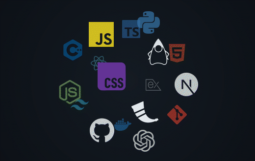

###  Notable Projects

**[NJIT Schedule Pro](https://github.com/donovanmchenry/njitschedulepro)** - Auto-generates clash-free course schedules for students at NJIT!

**[NJIT Empty Room Finder](https://github.com/donovanmchenry/njitemptyroomfinder)** - Finds potential empty rooms on campus (rooms with no classes)!

### Technical Skills

<picture>
  <source media="(prefers-color-scheme: dark)" srcset="./assets/skill-cloud-dark.gif">
  <source media="(prefers-color-scheme: light)" srcset="./assets/skill-cloud-light.gif">
  
</picture>
<strong>Languages</strong> 

 

  
<strong>Frontend</strong> 

 

  
<strong>Backend and APIs</strong> 

 

  
<strong>Tools and AI</strong> 

 

 
 

### Contact Info

